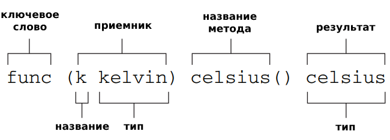

# [Назад](/L1/L1_.md)

## В чем отличие? метода по указателю (*cl1) f1() и метода по экземпляру (cl1) f1()

### Ответ

Метод по указателю

- Получаем адрес получателя (приемника)
- При изменении меняется сам получателя (приемника)

 Метод по значению  

- Получаем копию получателя(приемника)
- При изменении мы меняем копию получателя (приемника), а не сам получателя (приемника)

--------------------------------

Методы могут быть определены для любого именованного типа (кроме указателя или интерфейса); получатель не обязательно должен быть структурой.

--------------------------------
В Go методы могут принимать получатель (receiver) как значение (value receiver), так и указатель (pointer receiver). Различие между этими двумя типами получателей влияет на то, как они работают и как они взаимодействуют со значениями типа.

Метод с получателем в виде значения (value receiver) принимает копию значения типа как получатель. Это означает, что, когда мы вызываем метод на конкретном значении типа, внутри метода будет работать с копией этого значения. В этом случае, если метод пытается изменить значения полей этой копии, исходное значение не будет изменено.



Вот пример метода `Increment`, принимающего значение типа `Counter`:

```go
type Counter struct {
    value int
}

func (c Counter) Increment() {
    c.value++
}

func main() {
    counter := Counter{value: 0}
    counter.Increment()
    fmt.Println(counter.value) // Вывод: 0
}
```

Здесь метод `Increment` вызывается на значении `counter`, но когда мы пытаемся увеличить значение поля `value`, оно не изменяется, так как метод работает с копией значения.

Метод с получателем в виде указателя (pointer receiver) принимает указатель на значение типа в качестве получателя. В этом случае, когда мы вызываем метод на конкретном значении типа, он работает с исходным значением "на месте". Таким образом, если метод изменяет значение полей, эти изменения будут отражены в исходном значении.

Вот пример метода `Increment`, принимающего указатель на значение типа `Counter`:

```go
func (c *Counter) Increment() {
    c.value++
}

func main() {
    counter := Counter{value: 0}
    counter.Increment()
    fmt.Println(counter.value) // Вывод: 1
}
```

Здесь метод `Increment` вызывается на значении `counter`, и когда мы увеличиваем значение поля `value`, оно действительно изменяется, так как метод работает с исходным значением по указателю.

Использование методов по указателю позволяет изменять значения полей в исходном значении типа, в то время как методы по значению работают с копией значения. Поэтому выбор между методом по указателю и методом по значению зависит от требований приложения и ожидаемого поведения метода.
